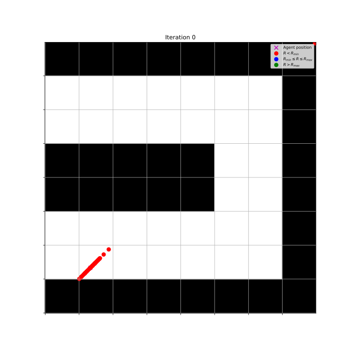
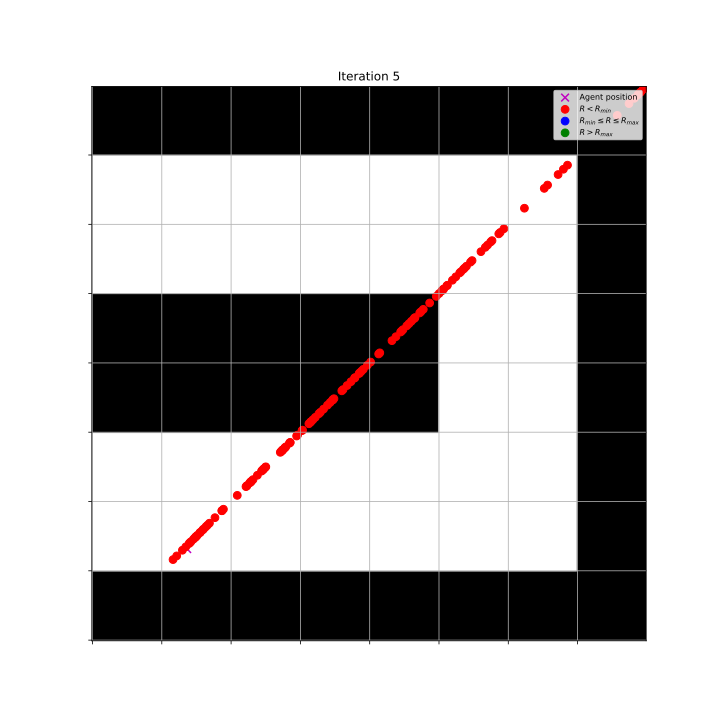
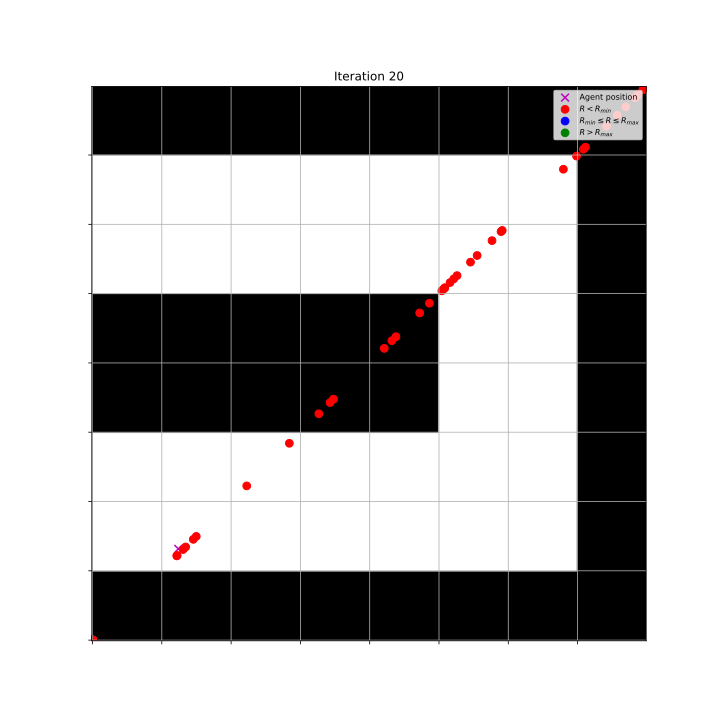
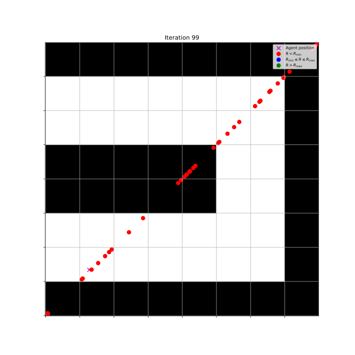

# Goal-GAN for DDPG Agent

- This repository contains code for reproducing results from Bachelor thesis, that tests
an existing Goal-GAN algorithm on off-policy method (DDPG more specifically)

- The results could be similar to the following images

| Iteration 1    | Iteration 6    |
| -------------- | -------------- |
|    | |

| Iteration 21   | Iteration 100   |
| -------------- | -------------- |
|    | |


## Installation
- First, install mujoco, the installation instructions can be found on their [Github-page](https://github.com/openai/mujoco-py) (NOTE: as of writing, only version 2.10 of mujoco is supported)
- Then, follow the installation instruction from [here](https://github.com/geyang/jaynes-starter-kit/tree/master/07_supercloud_setup). This tutorial shows step by step how the correct enviroment variables are set (for linux)
- Note that mujoco-py supports only Linux and MacOS.

- Pip installation:
  - Create a virtual enviroment using _venv_
  ```shell
    python -m venv path/to/virtual/enviroment
  ```
  - Activate the enviroment, with bash/zsh
  ```shell
  source <venv>/bin/activate
  ```
  where the <venv> is path to the just created virtual enviroment
   (see [this](https://docs.python.org/3/library/venv.html) for the command for e.g. csh or windows)
  - Install the needed packages
  ```shell
  pip install -r requirements.txt
  ```
- Conda installation
  - Create virtual environment from the _environment.yml_ file
  ```shell
  conda env create -f environment.yml
  ```
  - Activate the virtual environment
  ```shell
  conda activate <name-of-the-env>
  ```
- Additionally, Pytorch is required. Refer to [Pytorch's own documentation](https://pytorch.org/get-started/locally/) for installation guide. The code was written targeting v1.10.1.

## Reproducing the results
To reproduce the results from the thesis, run
```shell
python main.py train --goal-count=150 --episode-count=100 --gan-iter-count=150 --buffer-size=10000 --actor-batch-norm --critic-batch-norm --save-after=10 --gan-save-path=path/where/models/saved/gan.tar --agent-save-path=path/where/models/saved/agent_model_name.tar
```
- This will train the agent using exact same settings than in the thesis. Note that the script automatically appends the iteration count to the saved model name, so none of the saved models will be overwritten during the training. Note that this process is quite time consuming.


- The CLI contains quite many different parameters that one can use to alter the training of the model without touching the underlying code, so just run
```shell
python main.py train --help
```
to see all the options.

## Evaluating the performance of the trained Agent
To evaluate the performance of the trained agent, run
```shell
python main.py eval <path/to/the/model.tar> --buffer-size=10000 --critic-batch-norm --actor-batch-norm --render  
```
- Note that the hyperparameters of the DDPG that were used during the training must be set also here (otherwise the model loading will fail to a mismatch of structures.)
- The eval script also contains a few options to alter it's functionality, so check the help to see all possible options.
